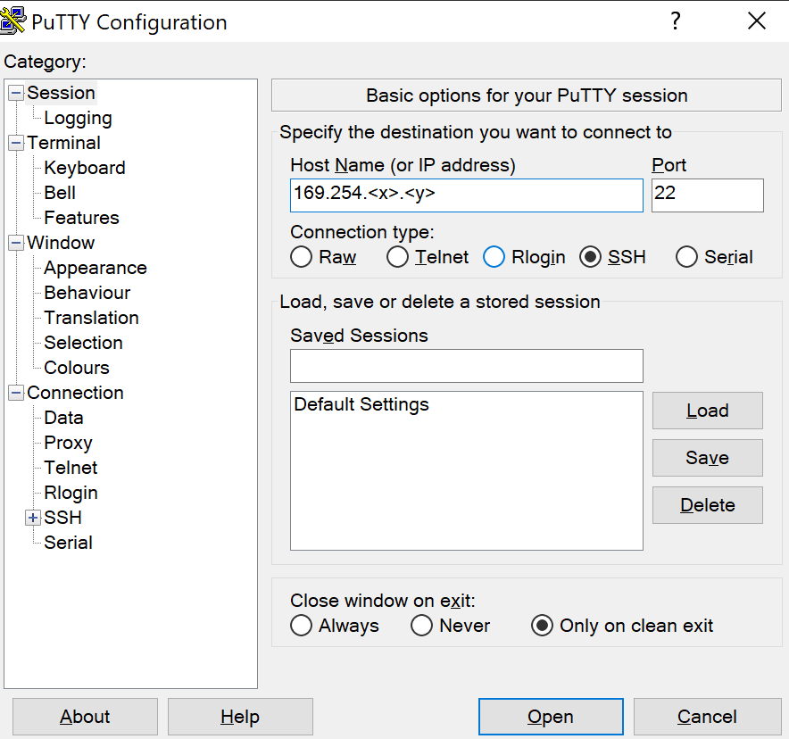
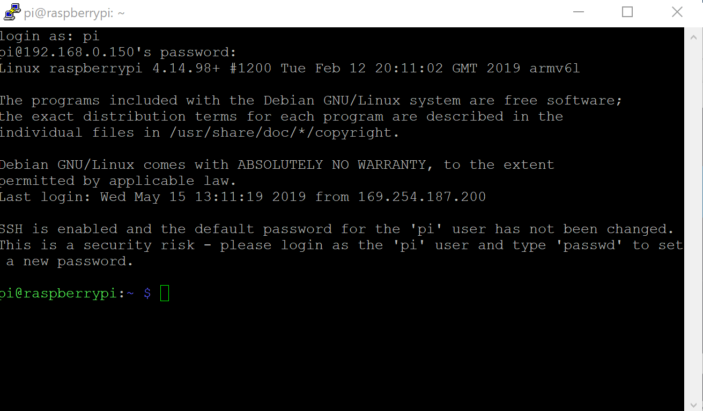
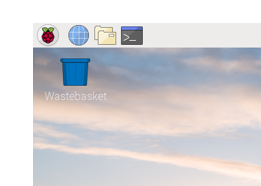

# Initial Device setup

## Requirements

### Hardware

* Raspberry Pi 0w with camera module installed. https://www.raspberrypi.org/products/raspberry-pi-zero-w/ and https://www.raspberrypi.org/products/camera-module-v2/  
* Housing https://www.raspberrypi.org/products/raspberry-pi-zero-case/ and https://www.raspberrypi.org/magpi/pi-zero-w-official-case/  
* Power supply (>1.2A suggested)
* Micro USB cable (to run the device as an USB client for setup)

### Environment

* A wifi network with internet access, e.g., a home wifi router 
* A PC or Mac with an SD card drive. Instructions are provided for Windows, other platforms tbd. 

## Downloads

* Download and install etcher https://www.balena.io/etcher/ 
* Download and install putty https://www.chiark.greenend.org.uk/~sgtatham/putty/  
* Download or build custom Raspbian (See https://github.com/holgerkenn/pi-gen )
  * Direct download link https://github.com/holgerkenn/pi-gen/releases/download/v0.1/image_2019-05-22-vision-full.zip

## Installation

* Flash SD card with Raspbian using balenaEtcher 
  * Run Etcher and flash .zip file to micro SD card. 
  * DON’T unpack zip to SD card, this will not work!
* After flashing, the “boot” filesystem of the raspberry pi will appear as a new drive. 
* Change the configuration in the boot file system
  * Open cmdline.txt and add `modules-load=dwc2,g_ether` behind `rootwait` to the commandline
  * Open config.txt and add `dtoverlay=dwc2` in a new line at the end of the file 
  * Add a file wpa_supplicant.conf to the boot directory with the following content: 
```
country=GB 
ctrl_interface=DIR=/var/run/wpa_supplicant GROUP=netdev 
update_config=1 
ap_scan=1 
```
  * Add the following section to the file if you use a network with a name and password, put in your network SSID and password: 
```
network={ 
ssid="<yournetworkname>" 
psk="<yournetwork password>" 
} 
```
* Insert the SD card into the Pi 
* Connect the power supply to the Raspberry Pi 
* Check the web page of your router to see if the Raspberry Pi successfully connected to it, note its IP address.
* Connect to your raspberry pi using putty 



* Accept the SSH host key (click YES) 
* Username is “pi”, initial password is “raspberry”.  
* You should see something like this: 



* As an alternative, you can also attach screen, mouse and keyboard to your raspberry pi and use it to perform these instructions. You can use the shell icon on the desktop to get a command shell.




## Setup instructions once the Raspberry Pi is up and running

* enable the Raspberry Pi Camera
  * type `sudo raspi-config`
  * then select entry "5 – Interfacing Options" 
  * and there "P1 Camera", 
  * then select "yes". 
  * Return to the main menu
  * select "reboot" on exit.
  * The raspberry pi will terminate the connection and reboot.
* test the camera
  * wait for the Raspberry Pi to reboot and connect again as described above.
  * take a picture via the command line: `raspistill -o test.jpg`
  * (taking the picture takes about 10 seconds)
  * See https://www.raspberrypi.org/documentation/usage/camera/raspicam/raspistill.md for more information on the camera. 
