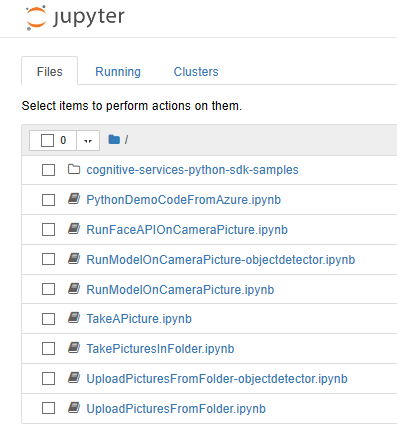
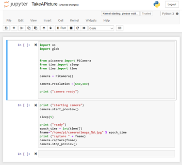

# Preparation

## Requirements

* Azure Account, get one [here](https://https://azure.microsoft.com/free/)
* Custom vision service, see [here](https://docs.microsoft.com/en-us/azure/cognitive-services/custom-vision-service/getting-started-build-a-classifier) for a web-based quickstart tutorial.
* The raspberry pi setup [this way](setup.md)
* The software installed [this way](download.md)

## Open the Jupyter notebook server

* access the Jupyter notebook server on your Raspberry Pi by navigating to `http://<raspberry pi address>:8888/`
* Log in with the password you have set up before
* You should now see the file viewer of the Jupyter notebook server

## Taking a picture to test the camera

* Click on "TakeAPicture.ipynb". A new tab will open in your browser.

* Select the first cell and run it. This opens the camera
* Select the second cell and run it. This takes a single picture.
* Go back to the file viewer tab, press refresh, a file called "image.jpg" appears
* Click on "image.jpg" and you can see the picture that has been taken.
* Click on the "Running" tab and stop the Python kernel of the notebook by pressing "shutdown".

# Walkthrough

## create a custom vision service and general classification project

* navigate to (https://customvision.ai) and create a new custom vision service resource.
  * Login with the account that has your azure subscription
  * Click on the wheel on the upper right and look at the list of resources
  * if you have already created a custom vision ressource before in the browser based workshop, you can use that one
  * if you don't see a resource, create a new cognitive service resource.

* create a new project
  * head back to the main view by clicking on the eye symbol in the upper left
  * click on "new project"
  * create a general classification project. Just enter a name, select the right resource, leave the other fields at their defaults.
    * if you have created a custom vision resource of type "Free[F0]", you can only create two projects 
  * Click on the wheel in the upper right
  * Copy the project ID, the key and the resource ID from the page into a text editor. You will need them later. Also remember the endpoint URL.

## Taking pictures

* Go back to the Jupyter file viewer
* Click on "TakePicturesInFolder"
* Run cells 1 and 2 
* Now chose two different objects you want to identify.
* Place the first object in front of the camera. 
* Position your camera  and run cell 3 *DON'T RUN CEll 4 YET*
* Move the object and the camera and run cell 3 again. Repeat this about 10 times for the first object.
* Place the second object in front of the camera.
* Move the object and the camera and run cell 3 again. Repeat this about 10 times for the second object.
* Now you can run cell 4 to shut down the camera.
* Shut down the kernel to free the camera.

## Uploading training pictures

* Go back to the Jupyter file viewer
* Click on "UploadPicturesInFolder"
* Edit the notebook and replace the placeholders with your project data
  * Enter the key at "training_key" and "prediction_key"
  * Enter the Project ID at "projectid
  * Enter the resource ID at "prediction_resource_id"
  * Check if the endpoint URL is correct.
* Now run all the cells in order to upload your pictures.

## Train your model

* head back to (https://customvision.ai)
* Switch to the "training images" tab
* Click on "untagged"
* Tag all the images
  * Select an image
  * enter a text tag or select one that has been entered before
* Click on "tagged"
* Check if all images are correctly tagged
* Press the green "Train" button
  * Do a quick training first.
* after the training is finished, click on "publish" to publish your trained model

## Use the model from your Raspberry Pi

* Go back to the Jupyter file viewer
* Click on "RunModelOnCameraPicture"
* Enter your project information into the placeholders as before
* Run Cells 1-3 to prepare taking pictures
* Run Cell 4 to take a picture
* Run Cell 5 to send the picture to the cloud for analysis and to print the results

